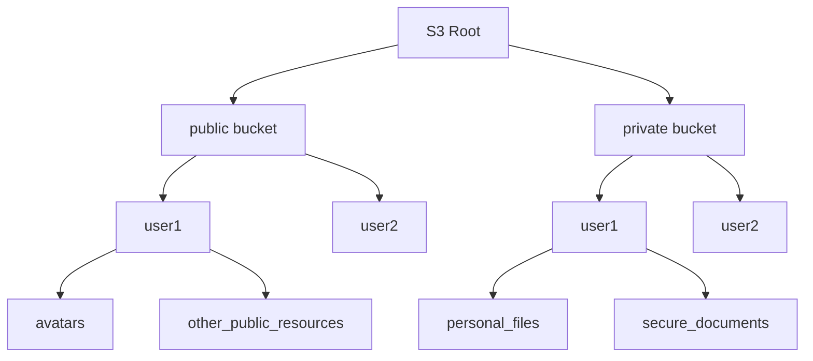

# brainrot

## Requirements

- redis >= 7.4.0 (HEXPIRE available since this version)
- mysql >= 5.7

## Tools

- 可以安装 [`just`](https://github.com/casey/just#installation) 来获得从 justfile 安装工具链的能力，执行 `just deps` 即可。
- 如果不想安装 `just`，可以直接在项目根目录下执行 `go generate tools.go`。

但是请注意，以上方法都无法安装 `protoc` ，需要[手动安装](https://grpc.io/docs/protoc-installation/)。

如果不在意 `goctl` 提供的安装方式（同时安装 `protoc`, `protoc-gen-go`, `protoc-gen-go-grpc`）也可以执行 `goctl env check --install --force` 或 `just dep-goctl-env`（对于 `just` 用户）。

## S3 storage design

